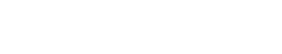

<a name="readme-top"></a>

<!-- PROJECT SHIELDS -->
<!--
*** I'm using markdown "reference style" links for readability.
*** Reference links are enclosed in brackets [ ] instead of parentheses ( ).
*** See the bottom of this document for the declaration of the reference variables
*** for contributors-url, forks-url, etc. This is an optional, concise syntax you may use.
*** https://www.markdownguide.org/basic-syntax/#reference-style-links
-->

[![MIT License][license-shield]][license-url]

<!-- PROJECT LOGO -->
<br />
<div align="center">
  <a href="https://github.com/SecondSE/LP">
    
  </a>

  <h3 align="center">Second Sight Experience</h3>

  <p align="center">
    An independent creative agency specializing in curating relationships between brands and consumers.
    <br />
    <a href="https://www.secondsightexperience.nyc/">View Live</a>
    ·
    <a href="https://github.com/SecondSE/LP/issues">Report Bug</a>
  </p>
</div>

<!-- TABLE OF CONTENTS -->
<details>
  <summary>Table of Contents</summary>
  <ol>
    <li>
      <a href="#about-the-project">About The Project</a>
      <ul>
        <li><a href="#built-with">Built With</a></li>
      </ul>
    </li>
    <!-- <li>
      <a href="#getting-started">Getting Started</a>
      <ul>
        <li><a href="#prerequisites">Prerequisites</a></li>
        <li><a href="#installation">Installation</a></li>
      </ul>
    </li> -->
    <li><a href="#roadmap">Roadmap</a></li>
    <li><a href="#license">License</a></li>
    <li><a href="#contact">Contact</a></li>
    <li><a href="#acknowledgments">Acknowledgments</a></li>
  </ol>
</details>

<!-- ABOUT THE PROJECT -->

## About The Project

[![Product Name Screen Shot][product-screenshot]](https://www.secondsightexperience.nyc/)

Second Sight is an independent creative agency with a knack for storytelling and the vision to bring your brand to life through omnichannel experiences.

We're committed to creating experiences that drive tangible business results. Whether making your first big splash as a brand to land your first customer or scaling to your 1,000th, we're here to get you there.

Let's build together.

<p align="right">(<a href="#readme-top">back to top</a>)</p>

### Built With

The following are major frameworks/libraries used to bootstrap this project.

[![TypeScript][typescript-shield]][typescript-url] [![Next][next-shield]][next-url] [![CSS][css-shield]][css-url]

<p align="right">(<a href="#readme-top">back to top</a>)</p>

<!-- GETTING STARTED -->

<!-- ## Getting Started

To get a local copy up and running follow these steps.

### Prerequisites

Prior to proceeding, ensure that npm has been installed. Use the following to check npm version

```sh
npm --v
```

If it has not yet been installed, follow the appropriate steps to do so.

```sh
npm install npm@latest -g
```

### Installation

1. Clone the repo
   ```sh
   git clone https://github.com/Asalz20/pectusplus-blog.git
   ```
2. Install NPM packages at root, web, and studio directory
   ```sh
   npm install
   ```
3. In order to spin up your own sanity backend, head over to [Sanity.io](https://sanity.io/) and follow their Getting started documentation.

4. Run the following in the web directory to start the development server

```sh
   npm start
```

<p align="right">(<a href="#readme-top">back to top</a>)</p> -->

<!-- USAGE EXAMPLES -->

<!-- ## Usage

Use this space to show useful examples of how a project can be used. Additional screenshots, code examples and demos work well in this space. You may also link to more resources.

_For more examples, please refer to the [Documentation](https://example.com)_

<p align="right">(<a href="#readme-top">back to top</a>)</p> -->

<!-- ROADMAP -->

## Roadmap

<!-- - [x] Add Blog Posts
- [ ] Review and add medical articles
- [ ] Multi-language Support
  - [ ] Spanish -->

See the [open issues](https://github.com/SecondSE/LP/issues) for a full list of proposed features (and known issues).

<p align="right">(<a href="#readme-top">back to top</a>)</p>

<!-- LICENSE -->

## License

Distributed under the MIT License. See `LICENSE.txt` for more information.

<p align="right">(<a href="#readme-top">back to top</a>)</p>

<!-- CONTACT -->

## Contact

Second Sight Experience - nick@secondsightexperience.nyc

<p align="right">(<a href="#readme-top">back to top</a>)</p>

<!-- ACKNOWLEDGMENTS -->

## Acknowledgments

Giving credit where credit is due! Thank you to:

- [Img Shields](https://shields.io)
- [GitHub Pages](https://pages.github.com)
- [React Icons](https://react-icons.github.io/react-icons/search)

<p align="right">(<a href="#readme-top">back to top</a>)</p>

<!-- MARKDOWN LINKS & IMAGES -->
<!-- https://www.markdownguide.org/basic-syntax/#reference-style-links -->

[license-shield]: https://img.shields.io/github/license/SecondSE/LP.svg?style=for-the-badge
[license-url]: https://github.com/SecondSE/LP/issues
[product-screenshot]: ./public/imgs/secondsight.png
[react.js]: https://img.shields.io/badge/React-20232A?style=for-the-badge&logo=react&logoColor=61DAFB
[react-url]: https://reactjs.org/
[gatsby.js]: https://img.shields.io/badge/Gatsby-BC77C6?style=for-the-badge&logo=gatsby&logoColor=663399
[gatsby-url]: https://www.gatsbyjs.com/docs/
[sanity-shield]: https://img.shields.io/badge/-Sanity-FC4C02?style=for-the-badge&logo=stripe&logoColor=white
[sanity-url]: https://sanity.io/
[javascript-shield]: https://img.shields.io/badge/-JavaScript-323231?style=for-the-badge&logo=javascript&logoColor=f7df1e
[javascript-url]: https://developer.mozilla.org/en-US/docs/Web/JavaScript
[css-shield]: https://img.shields.io/badge/-CSS-AFB3B5?style=for-the-badge&logo=css3&logoColor=1572B6
[css-url]: https://developer.mozilla.org/en-US/docs/Web/CSS
[next-shield]: https://img.shields.io/badge/-Next-ffffff?style=for-the-badge&logo=next.js&logoColor=000000
[next-url]: https://developer.mozilla.org/en-US/docs/Web/CSS
[typescript-shield]: https://img.shields.io/badge/-TypeScript-84C8EA?style=for-the-badge&logo=typescript&logoColor=1572B6
[typescript-url]: https://www.typescriptlang.org/
